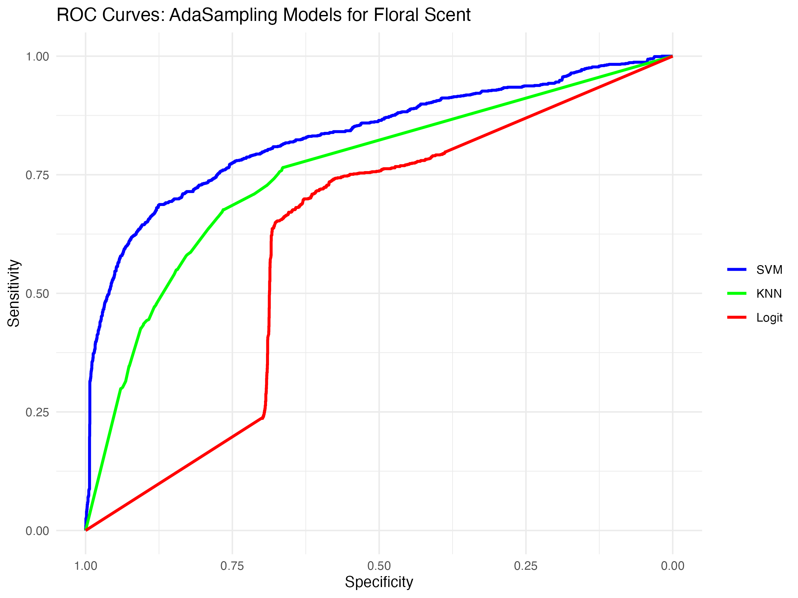
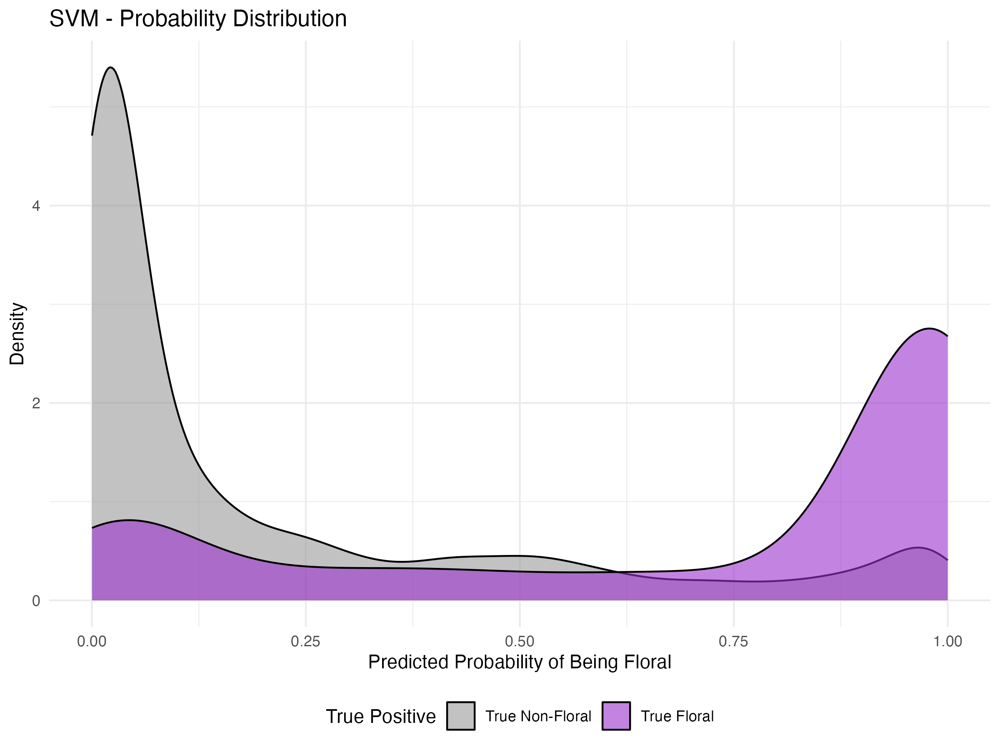
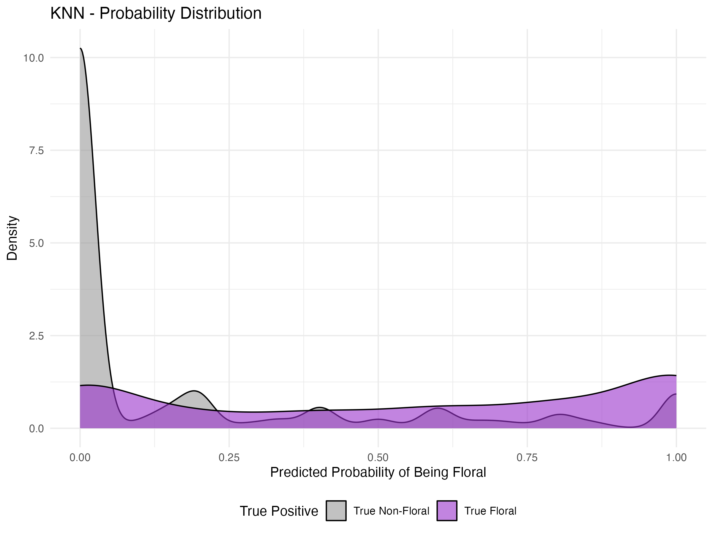
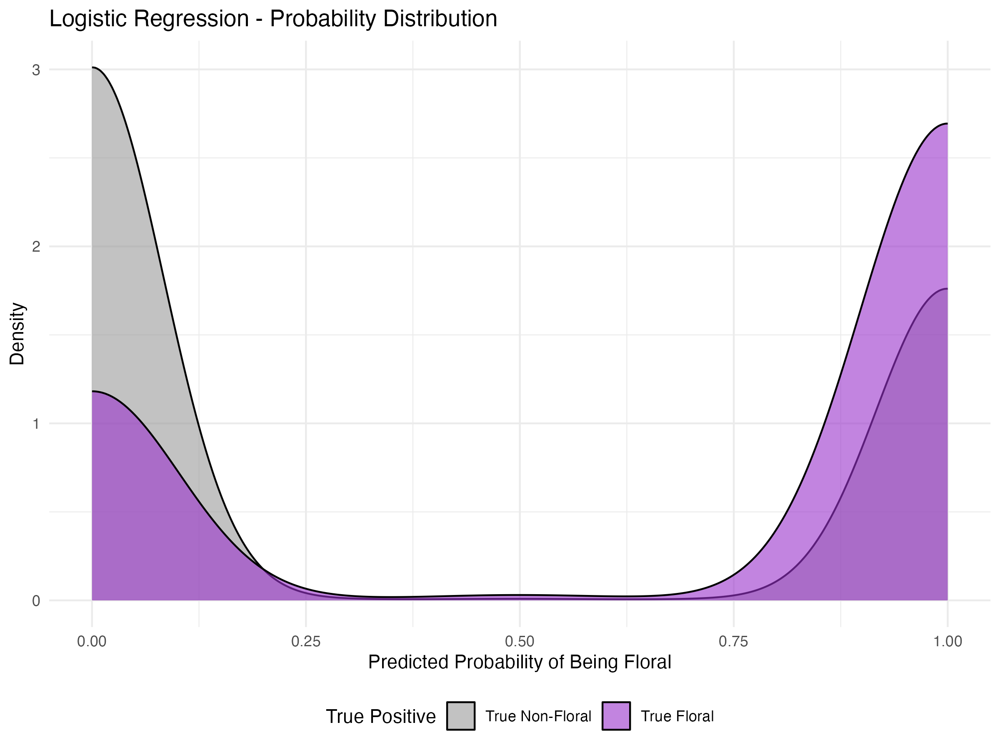

# Positive-Unlabeled (PU) Learning in Chemoinformatics and Olfaction

**Author:** Peace Maddox \| **GitHub:** [\@PeaceJM](https://github.com/PeaceJM)

### **Project Overview**

Real world data isn’t always cleanly labeled. We often have confirmed "positive" examples, but the remaining data is an unverified mix of true negatives and hidden positives. Applying models to the data without accounting for this label imbalance can cause biased decision boundaries and underestimated model performance. This project simulates a [Positive-Unlabeled (PU) learning](https://www.geeksforgeeks.org/machine-learning/why-positive-unlabeled-learning/) scenario to identify hidden "floral" scent molecules from a largely unlabeled chemical database.

The [`AdaSampling` package](https://cran.r-project.org/web/packages/AdaSampling/index.html) is a framework that iteratively identifies reliable negatives from the unlabeled pool to train a standard classifier. The default [Support Vector Machine (SVM)](https://en.wikipedia.org/wiki/Support_vector_machine), the system samples confident negatives, trains the SVM to draw a hyperplane, and refines the negative set based on that boundary, [k-Nearest Neighbors (KNN)](https://en.wikipedia.org/wiki/K-nearest_neighbors_algorithm) is used for irregular clusters, and [Logistic Regression (Logit)](https://en.wikipedia.org/wiki/Logistic_regression) is used for simple linear probability.

### **The Data: SMILES & Olfactory Perception**

The [dataset](https://www.kaggle.com/datasets/aryanamitbarsainyan/multi-labelled-smiles-odors-dataset/data) used for this project is of 4,983 molecules designed to replicate the ["Principal Odor Map" (OpenPOM)](https://github.com/BioMachineLearning/openpom) research. By merging the [GoodScents](http://www.thegoodscentscompany.com/) and [Leffingwell PMP 2001](https://zenodo.org/records/4085098#.YqoYk8jMIUE) databases, each molecule is able to be mapped to multiple descriptors like "floral" or "chocolate".

The features are created by parsing the chemical structures processed in [SMILES](https://en.wikipedia.org/wiki/Simplified_Molecular_Input_Line_Entry_System) format, using the `rcdk` [(Chemistry Development Kit) package](https://cran.r-project.org/web/packages/rcdklibs/index.html) into a [ECFP6 Circular Fingerprints](https://pubmed.ncbi.nlm.nih.gov/20426451/#:~:text=Abstract,been%20presented%20in%20the%20literature.)matrix.

For the PU Simulation, "floral" was designated as the target, and 30% of the known floral molecules were hid (1 -\> 0) to test the recovery power of the algorithms.

### **Model Evaluation**

|                |               |
|----------------|---------------|
| **Classifier** | **AUC Score** |
| SVM            | 0.833         |
| KNN            | 0.757         |
| Logit          | 0.608         |

## Technologies Used

-   **Language:** R

-   **Machine Learning:** `AdaSampling` (PU Learning), `e1071` (SVM), `caret`

-   **Chemoinformatics:** `rcdk`, `fingerprint`, `rJava`

-   **Evaluation & Viz:** `pROC`, `ggplot2`, `dplyr`  

# How to Run

-   **Configure Java:** Ensure a 64-bit JDK is installed (e.g., Temurin-25).

-   **Set Environment:** `R Sys.setenv(JAVA_HOME = "your/path/to/java") library(rJava) .jinit()  [cite_start]`

-   **Install Dependencies:** `install.packages(c("AdaSampling", "fingerprint", "rcdk", "pROC", "ggplot2"))`

-   **Execute:** Run `final_script.R` to reproduce the ROC curves and density distributions.

